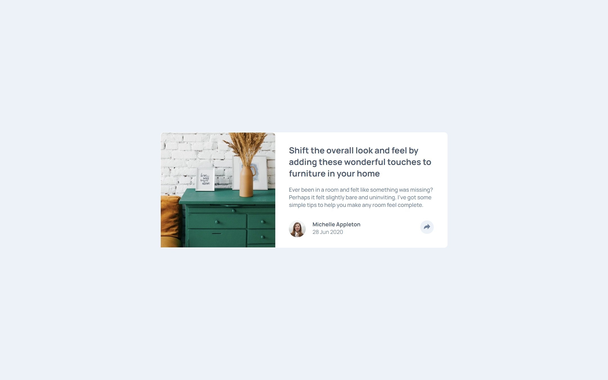

# Frontend Mentor - Article Preview Component Solution

A responsive article preview component built as part of the [Frontend Mentor Article Preview Component challenge](https://www.frontendmentor.io/challenges/article-preview-component-dYBN_pYFT).

The project focuses on creating a clean article preview card with a responsive layout and an interactive social sharing feature.

## Table of Contents

- [Overview](#overview)
  - [The Challenge](#the-challenge)
  - [Screenshot](#screenshot)
  - [Links](#links)
- [My Process](#my-process)
  - [Built With](#built-with)
  - [What I Learned](#what-i-learned)
  - [Continued Development](#continued-development)
  - [AI Collaboration](#ai-collaboration)
- [Author](#author)
- [Acknowledgments](#acknowledgments)

## Overview

### The Challenge

Users should be able to:

- View the component layout adapted to their device's screen size.
- Interact with the share button to reveal social media sharing links.
- Experience a consistent and accessible interface across screen sizes.

### Screenshot

### Links

- Solution URL: https://sathyakatrapalli2007.github.io/article-preview-master-component/
- Live Site URL: https://sathyakatrapalli2007.github.io/article-preview-master-component/g

### Built With

- Semantic HTML5
- CSS3
- CSS custom properties
- Flexbox
- CSS Grid 
- Responsive design
- JavaScript for the share interaction 

### What I Learned

Through this project, I worked on:

- Building a responsive component that adapts to different screen sizes.
- Structuring an article preview using semantic HTML.
- Managing spacing, alignment, typography, and visual hierarchy.
- Understanding how interactive share controls can be incorporated into a component.
- Considering how an interface should behave on both desktop and mobile devices.

### Continued Development

In future projects, I want to continue improving my understanding of:

- Responsive layouts and media queries.
- JavaScript DOM manipulation and event handling.
- Accessible interactive elements.
- Writing reusable and maintainable CSS.
- Translating design references into accurate web layouts.

### AI Collaboration

I used Gemini as a learning and debugging assistant during development.

- Helped clarify concepts and troubleshoot implementation issues.
- Discussed possible approaches to responsive layouts and interactive elements.
- Used explanations to understand the reasoning behind solutions rather than relying only on copied code.

## Author

- GitHub: [@sathyakatrapalli2007](https://github.com/sathyakatrapalli2007)
- Frontend Mentor: [@yourusername](https://www.frontendmentor.io/profile/@sathyakatrapalli2007)

## Acknowledgments

- [Frontend Mentor](https://www.frontendmentor.io/) for providing the challenge and design resources.
